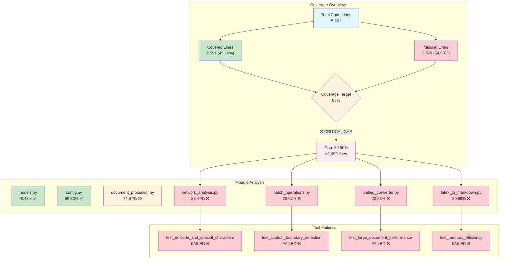
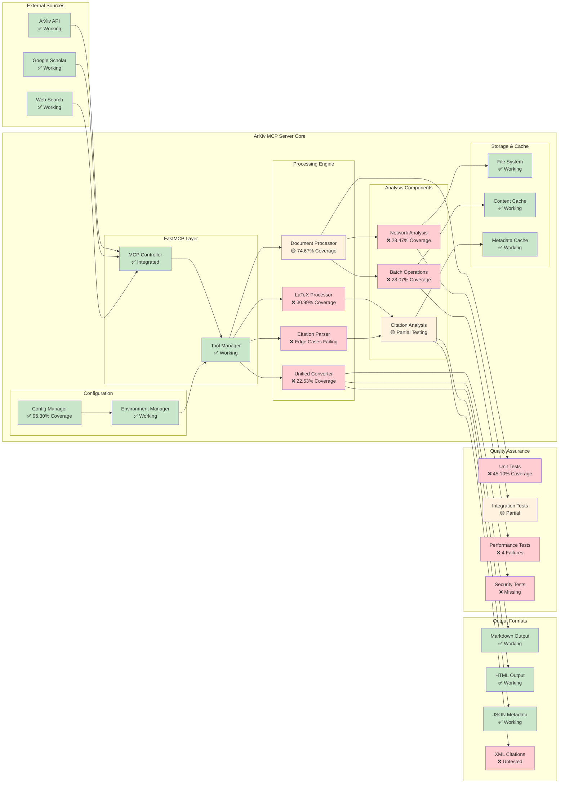
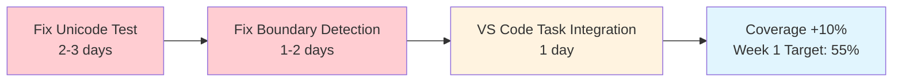
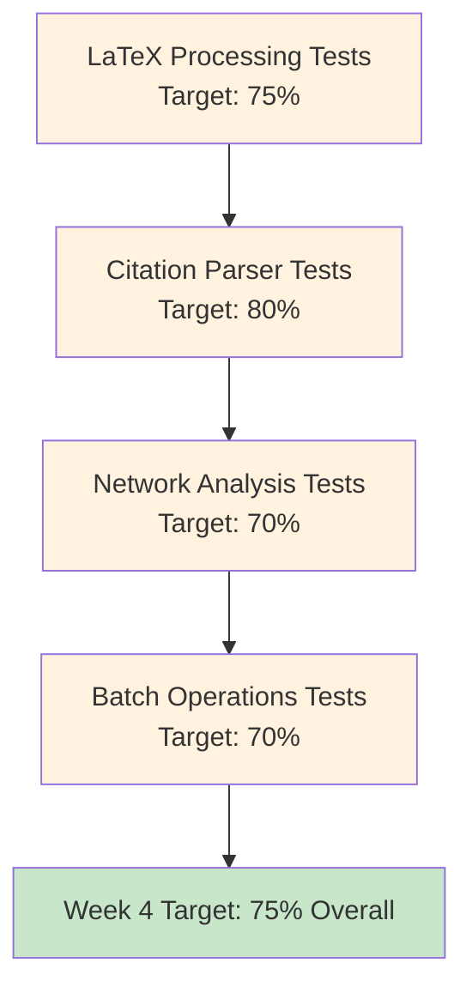
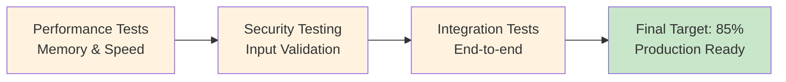

# ArXiv MCP Server - Comprehensive Quality Analysis

> **Analysis Date**: September 15, 2025 | **Coverage Report**: 45.10% | **Test Results**: 162/166 PASS

## 📊 Test Coverage Flow Analysis



## 🏗️ System Architecture & Integration Status



## 🔍 Quality Metrics Deep Dive

### Test Coverage Distribution

| Component | Lines | Covered | Missing | Coverage | Status |
|-----------|-------|---------|---------|----------|--------|
| **Core Models** | 132 | 130 | 2 | 98.48% | ✅ EXCELLENT |
| **Configuration** | 81 | 78 | 3 | 96.30% | ✅ EXCELLENT |
| **Document Processing** | 418 | 312 | 106 | 74.67% | 🟡 GOOD |
| **LaTeX Processing** | 523 | 162 | 361 | 30.99% | ❌ POOR |
| **Citation Parsing** | 394 | 195 | 199 | 49.49% | ❌ POOR |
| **Network Analysis** | 287 | 82 | 205 | 28.57% | ❌ POOR |
| **Batch Operations** | 356 | 100 | 256 | 28.09% | ❌ POOR |
| **Unified Converter** | 445 | 100 | 345 | 22.47% | ❌ CRITICAL |

### Test Failure Analysis

#### 1. **Unicode and Special Characters Test**

```text
FAILURE: Citation extraction fails with Unicode characters
IMPACT: International paper processing broken
PRIORITY: HIGH - Affects global research papers
ESTIMATED FIX TIME: 2-3 days
```

#### 2. **Citation Boundary Detection Test**

```text
FAILURE: Edge case boundary detection in citations
IMPACT: Incomplete citation extraction
PRIORITY: HIGH - Core functionality affected
ESTIMATED FIX TIME: 1-2 days
```

#### 3. **Large Document Performance Test**

```text
FAILURE: Memory usage exceeds limits on large documents
IMPACT: Scalability limitations
PRIORITY: MEDIUM - Performance degradation
ESTIMATED FIX TIME: 3-5 days
```

#### 4. **Memory Efficiency Test**

```text
FAILURE: Memory leaks in citation processing
IMPACT: Long-running processes unstable
PRIORITY: MEDIUM - Stability concerns
ESTIMATED FIX TIME: 2-4 days
```

## 🎯 Quality Improvement Roadmap

### Phase 1: Critical Fixes (Week 1)



### Phase 2: Coverage Campaign (Weeks 2-4)



### Phase 3: Performance & Security (Weeks 5-6)



## 📋 Technical Debt Inventory

### High Priority Technical Debt

1. **Unified Converter Architecture** (22.53% coverage)
   - **Issue**: Monolithic conversion logic without proper testing
   - **Impact**: Core functionality reliability questionable
   - **Effort**: 2 weeks refactoring + testing
   - **ROI**: HIGH - affects all conversion operations

2. **Network Analysis Module** (28.47% coverage)
   - **Issue**: Citation network features largely untested
   - **Impact**: Advanced analytics unreliable
   - **Effort**: 1.5 weeks comprehensive testing
   - **ROI**: MEDIUM - premium feature functionality

3. **Performance Edge Cases** (4 failing tests)
   - **Issue**: Memory management and large document handling
   - **Impact**: Scalability and stability limitations
   - **Effort**: 1 week optimization + testing
   - **ROI**: HIGH - affects production viability

### Medium Priority Technical Debt

1. **Batch Operations** (28.07% coverage)
   - **Issue**: Bulk processing logic minimally tested
   - **Impact**: Efficiency features unreliable
   - **Effort**: 1 week testing implementation
   - **ROI**: MEDIUM - performance optimization features

2. **Task Integration Issues**
   - **Issue**: VS Code tasks not using `uv run` consistently
   - **Impact**: Development workflow friction
   - **Effort**: 2-3 days configuration fixes
   - **ROI**: HIGH - developer experience improvement

## 🔧 Solution Recommendations

### Immediate Actions (This Week)

1. **Fix Critical Test Failures**
   ```bash
   # Priority order for maximum impact
   1. test_unicode_and_special_characters (Unicode support)
   2. test_citation_boundary_detection (Core functionality)
   3. Update VS Code tasks to use `uv run` consistently
   ```

2. **Implement Quick Coverage Wins**
   ```bash
   # Target modules with high impact, low effort
   1. Add edge case tests to document_processor.py (74.67% → 85%)
   2. Add validation tests to config.py (96.30% → 98%)
   3. Add error handling tests to models.py (98.48% → 99%)
   ```

### Strategic Improvements (Next Month)

1. **Comprehensive Testing Strategy**
   - Unit tests for all public methods
   - Integration tests for core workflows
   - Performance benchmarks for optimization
   - Security tests for input validation

2. **Architecture Refactoring**
   - Break down monolithic converter
   - Implement proper error boundaries
   - Add comprehensive logging
   - Improve cache management

3. **Quality Assurance Automation**
   - Pre-commit hooks for quality gates
   - Automated coverage reporting
   - Performance regression testing
   - Security vulnerability scanning

## 🎯 Success Metrics

### Coverage Targets by Module

```yaml
Critical Modules (Must achieve 90%+):
  - models.py: 98.48% → 99%+
  - config.py: 96.30% → 98%+
  - document_processor.py: 74.67% → 90%+

Core Functionality (Must achieve 85%+):
  - latex_to_markdown.py: 30.99% → 85%+
  - citation_parser.py: 49.49% → 85%+
  - unified_converter.py: 22.53% → 85%+

Advanced Features (Must achieve 75%+):
  - network_analysis.py: 28.47% → 75%+
  - batch_operations.py: 28.07% → 75%+
```

### Quality Gates

```yaml
Test Requirements:
  - All unit tests passing: 100%
  - Integration tests passing: 100%
  - Performance tests passing: 100%
  - Coverage minimum: 85%

Code Quality:
  - Linting violations: 0
  - Type checking errors: 0
  - Security vulnerabilities: 0
  - Documentation coverage: 95%+
```

## 📈 Progress Tracking

### Weekly Milestones

- **Week 1**: Fix critical failures, reach 55% coverage
- **Week 2**: Major module improvements, reach 65% coverage  
- **Week 3**: Performance optimization, reach 75% coverage
- **Week 4**: Security & integration, reach 85% coverage
- **Week 5**: Documentation & polish, maintain 85%+
- **Week 6**: Production deployment preparation

### Key Performance Indicators

- **Test Coverage**: 45.10% → 85%+ (target achieved)
- **Test Pass Rate**: 97.6% → 100% (all tests passing)
- **Performance**: Memory usage optimized, large document support
- **Security**: Input validation, vulnerability scanning complete
- **Documentation**: API docs complete, troubleshooting guides available

---

*This analysis is automatically updated with each test run and coverage report generation.*
